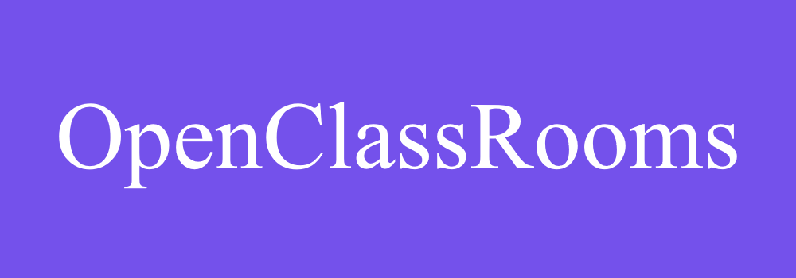
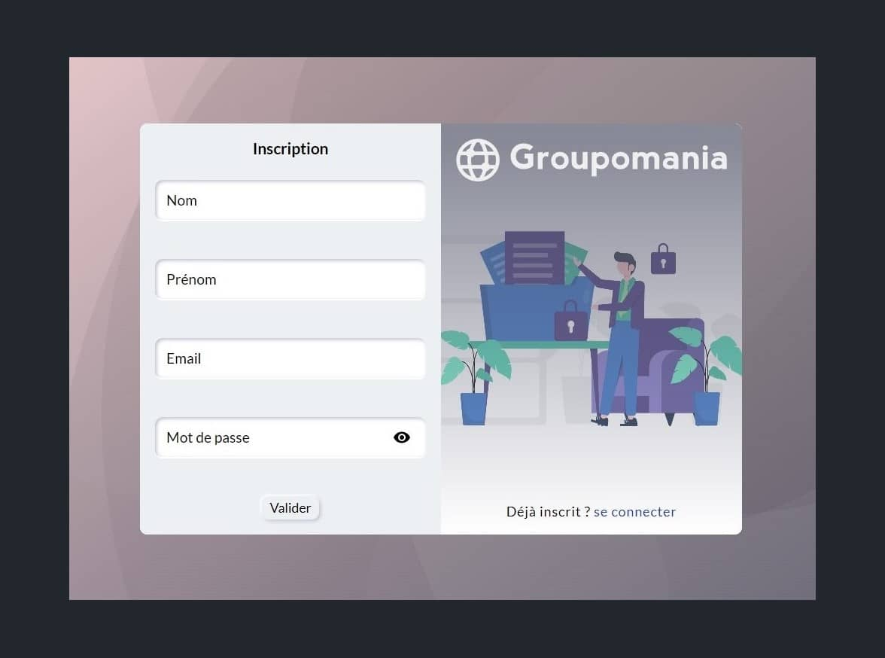
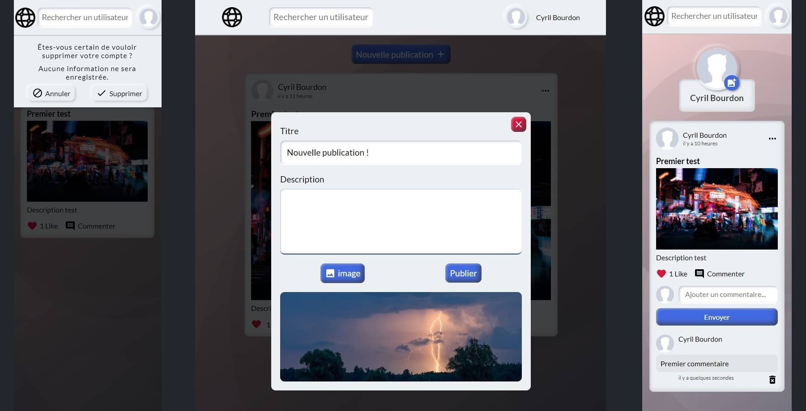

# Formation développeur web

## 📎 Projet 7 : Groupomania - Réseau social intranet






## Technologies :

### Back :
- Node.js
- Express
- mySQL

### Front : 
- React
- Sass


## Documentation API :

```
https://documenter.getpostman.com/view/23155868/2s8YszNVNi
```

## Installation :

Installer les dépendances dans chacuns des deux dossiers avec la commande `npm install`


### Frontend : 

A la racine du dossier front :\
créer un fichier `.env`
```
REACT_APP_BASE_URL = 'http://localhost:8080'
```
Démarrer ensuite le serveur avec la commande `npm run start`

### Backend :

A la racine du dossier back :\
créer un dossier `articleImages` à la racine du dossier `images`,\
créer un fichier `.env` en précisant une valeur pour chaque variable comme suit :
```
DB_HOST = '<Nom de domaine>'
DB_NAME = '<Nom base de donnée>'
DB_USER = '<Nom d'utilisateur base de donnée>'
DB_PASSWORD = '<Mot de passe base de donnée>'

PASSWORD_JWT = '0de67732-b0ff-4101-9ce0-57e9be97cbb6'
PASSWORD_CRYPTOJS = '9fnXMWP89bDqDW2Z633*-~Jm982nLdzS^tk3^&f|Z2H6]a#g]7^Q4~gL&XtG8<#qQz8'
```
Démarrer ensuite le serveur avec la commande `node server` ou `nodemon server` si ce paquet est installé sur votre machine

## Tester le projet :

```terminal
git clone https://github.com/Cyril-Develop/Groupomania.git
```
